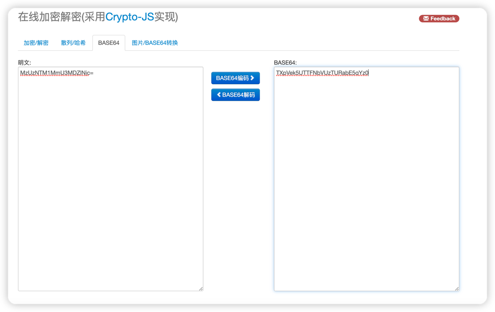
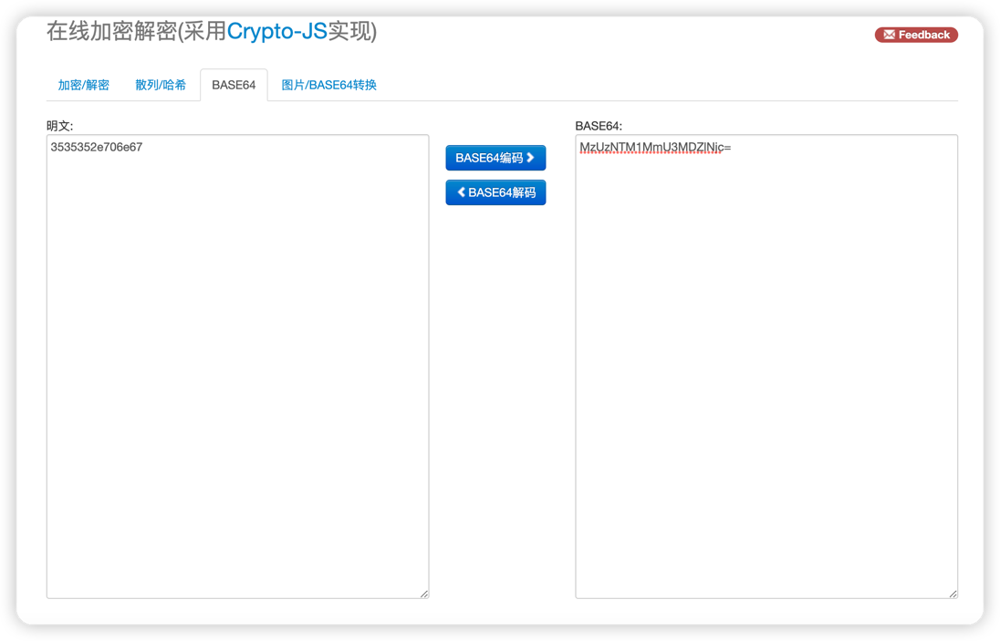
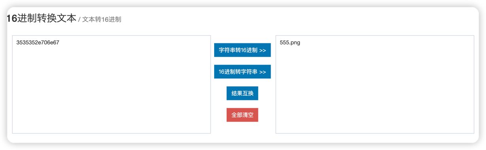

##靶场必备技能
* php代码审计
* md5碰撞
* base64加解码
* 文件包含

渗透思路：
观察url发现url中img=TXpVek5UTTFNbVUzTURabE5qYz0应该是bas64编码
方法一:

解密后还是一段base64

发现是一段16进制


方法二：
使用python实现
```python
from base64 import b64decode
from binascii import unhexlify

if __name__ == '__main__':
    str1 = 'TXpVek5UTTFNbVUzTURabE5qYz0'
    str2 = unhexlify(b64decode(b64decode(str1.encode())).decode())
    print(str2)

```

解密后发现是555.png,可能存在文件包含,使用python加密index.php拿到网站源码并存储到当前目录下
如想分析index.php可以查看exp.py [31:56],通过index.php发现大量过滤以及md5碰撞，尝试使用列表绕过,强转类型无法绕过
通过查询大神博客后找到payload,通过ca\t /flag进行绕过过滤

python3 exp.py "url"
例：python3 exp.py "http://f0a63277-1713-43b9-8033-42cff8570587.node4.buuoj.cn:81/index.php?img=TXpVek5UTTFNbVUzTURabE5qYz0&cmd="
即可获得flag

exp编写思路:

1.从命令行获取输入

2.对输入数据进行处理

3.解析img参数

4.将index.php进行加密

5.将url拼接后请求

6.请求后进行解密并保存

7.使用post请求将data中的payload进行发送并将ca\t /flag命令拼接到cmd参数中

8.请求后对response.text数据进行过滤

9.打印flag
