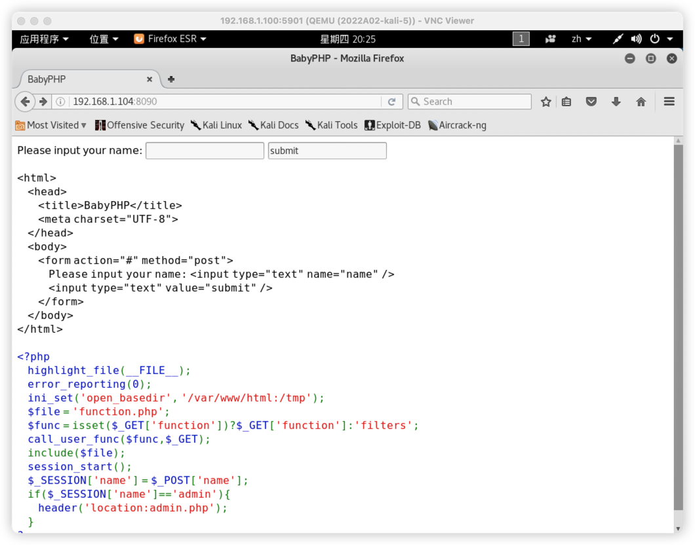
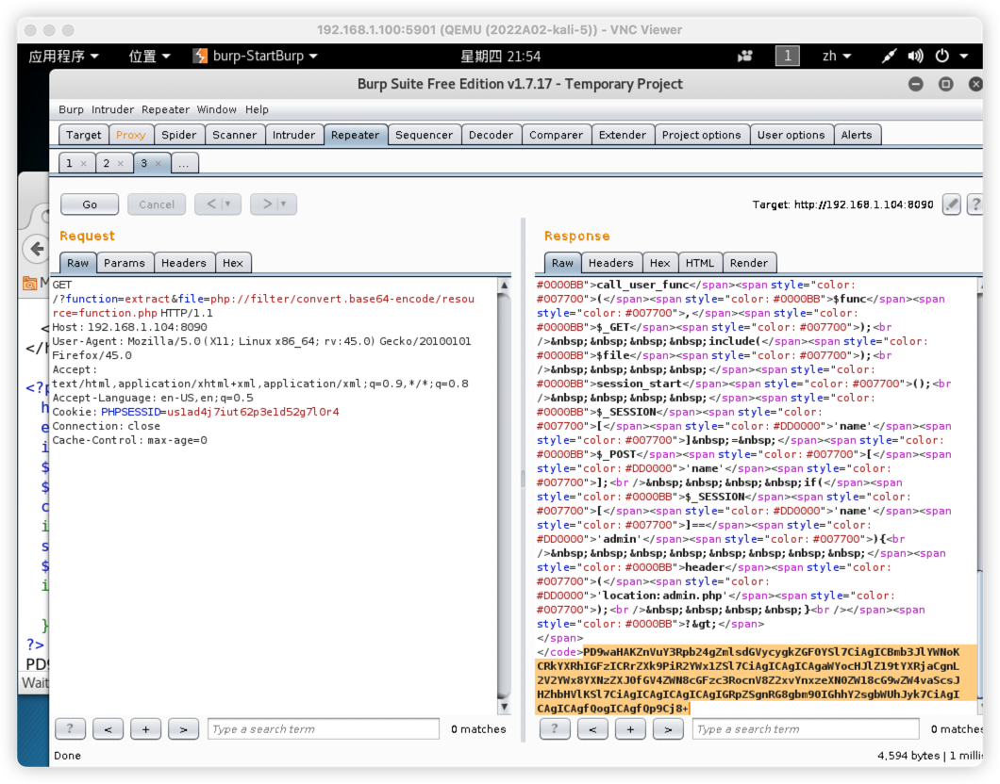
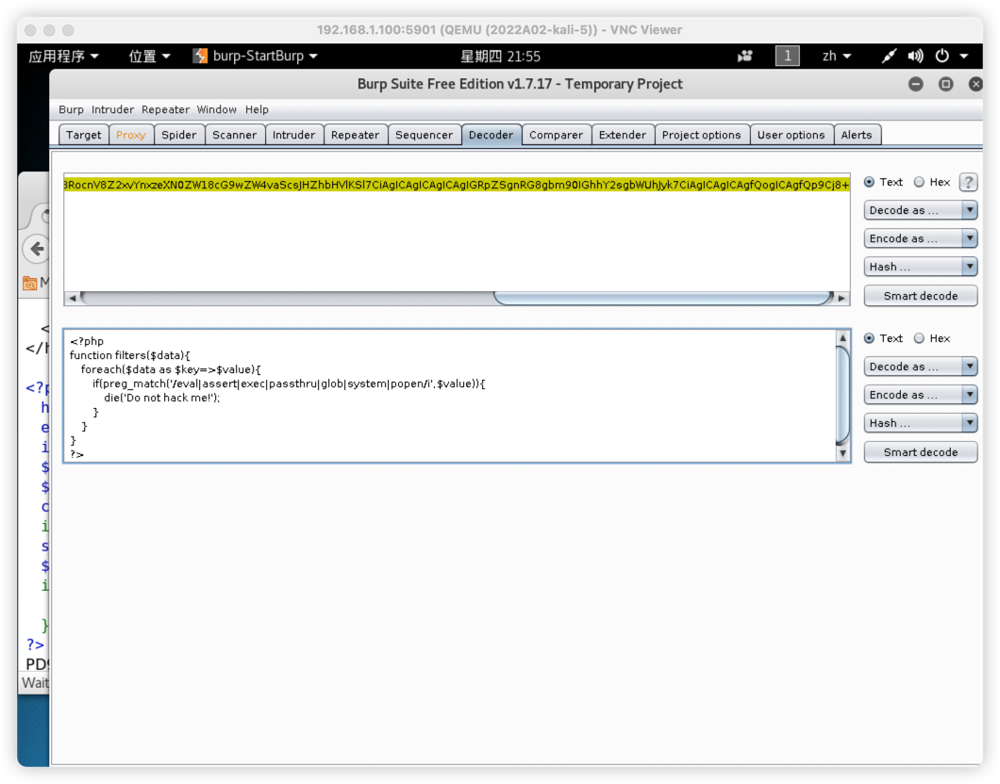
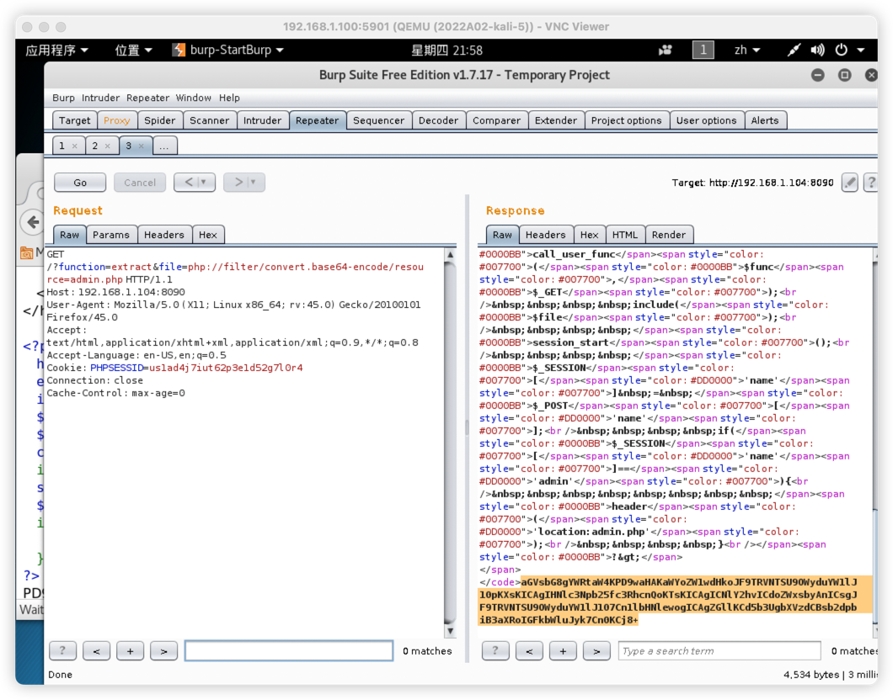
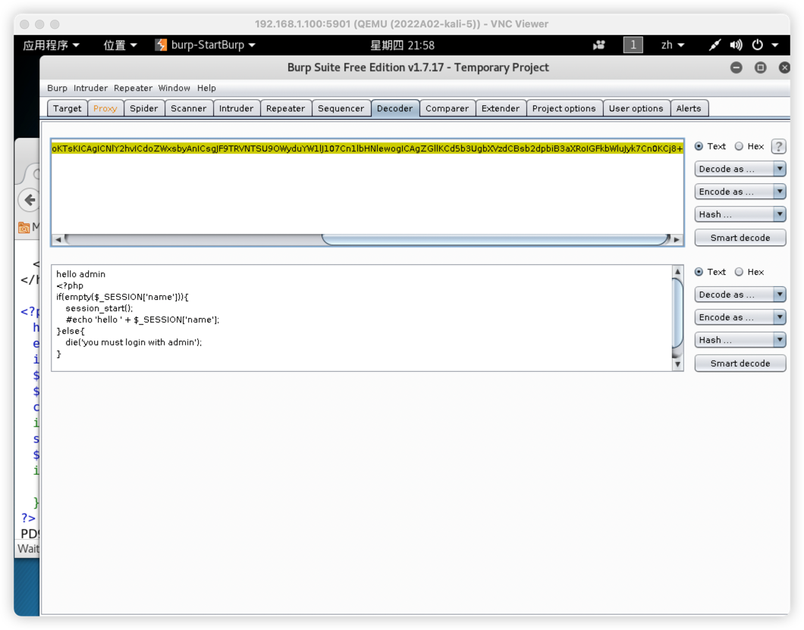
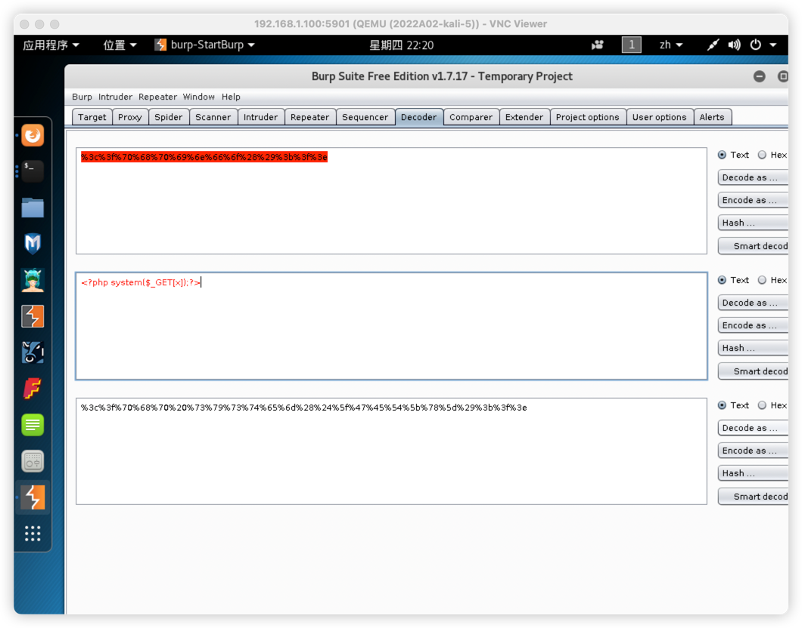
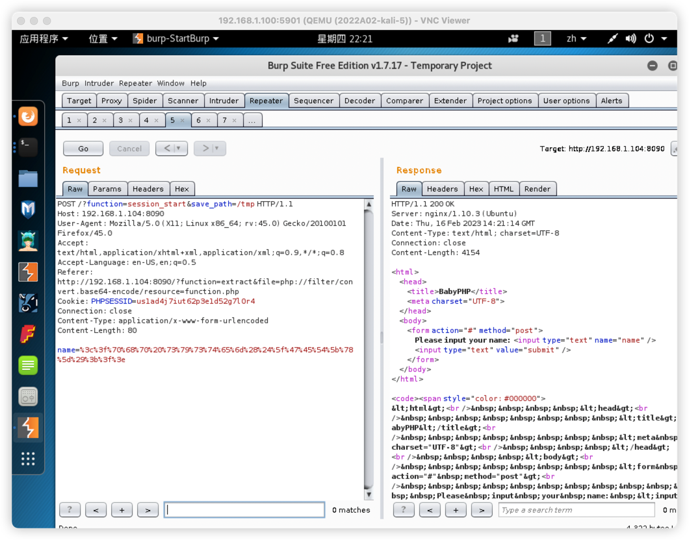
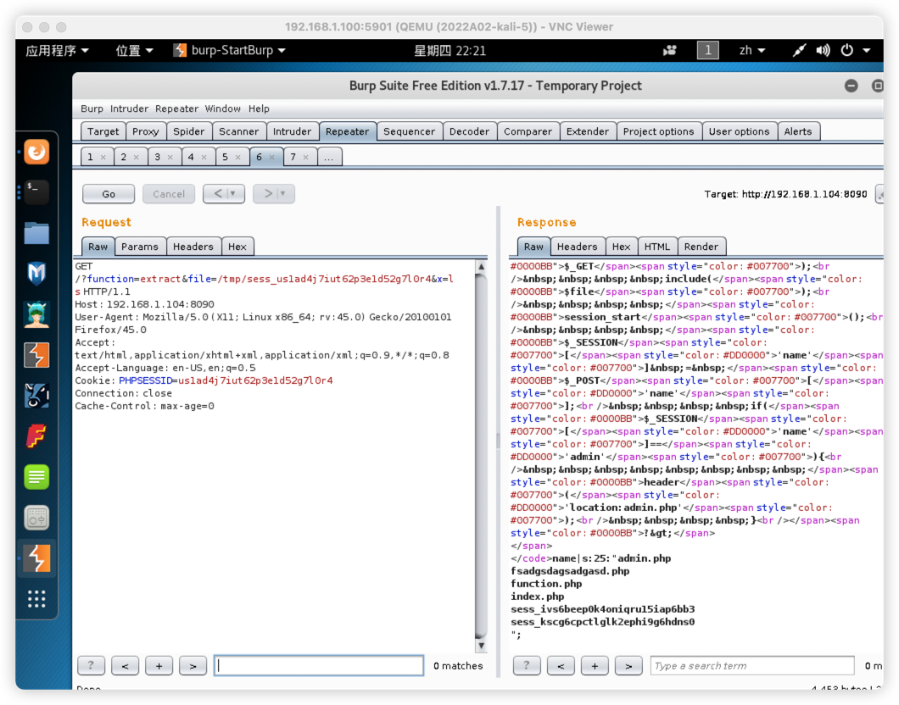
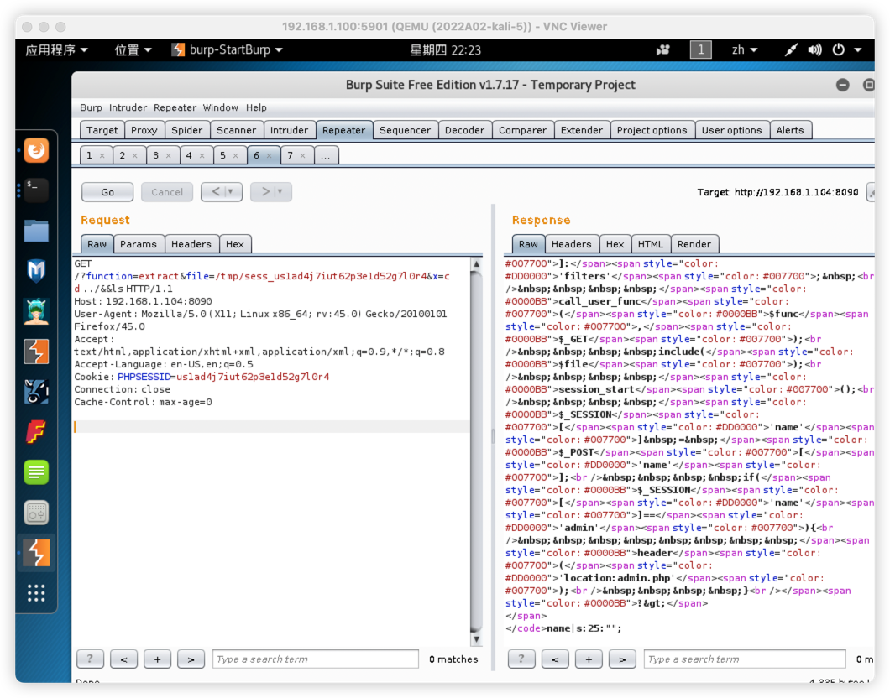
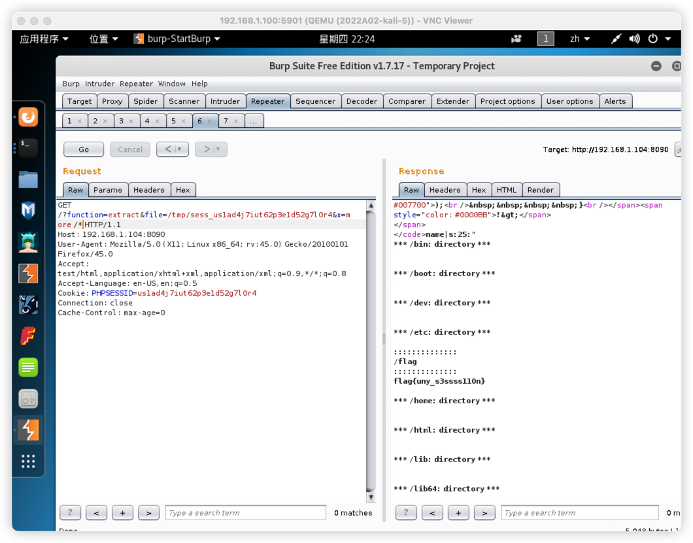

8090
主要考点：php代码审计，文件上传，文件包含

发现限制目录为/var/www/html 和 /tmp, 继续往下看发现有一个get参数function,
可以尝试文件读取, 首先尝试文件读取使用php://filter/read=convert.base64-encode/resource=function.php

尝试发送payload:?function=extract&file=php://filter/read=convert.base64-encode/resource=function.php

将base64解密后获得function.php源码

发现并没有重要信息

尝试读取admin.php,使用?function=extract&file=php://filter/read=convert.base64-encode/resource=admin.php

将base64解密后获得admin.php源码

发现其中有session_start()函数,尝试利用admin传入webshell，直接写入无法执行，需要编码后

可以使用webshell后发现目录下没有flag.txt,尝试使用cd../&&ls

发现不可用，尝试直接使用more /*

找到flag
