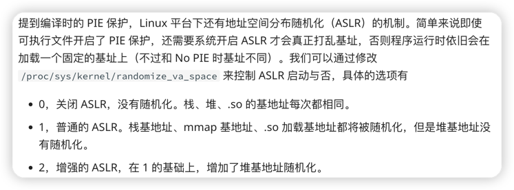
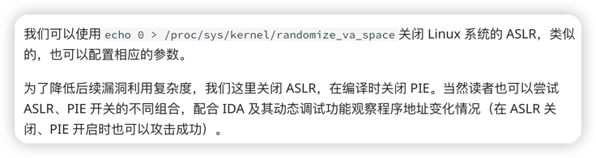

###栈介绍

栈是一种典型的后进先出的数据结构，主要操作：压栈(pull)，出栈(pop)

高级语言在运行时都会被转换为汇编程序，在汇编程序运行过程中，充分利用了这一数据结构。每个程序在运行时都有虚拟地址空间，其中某一部分就是该程序对应的栈，用于保存函数调用信息和局部变量。此外，常见的操作也是压栈与出栈程序的栈是从进程地址空间的高地址向低地址增长的

    x86
        函数参数在函数返回地址的上方
    x64
        System V AMD64 ABI (Linux、FreeBSD、macOS 等采用) 中前六个整型或指针参数依次保存在 RDI, RSI, RDX, RCX, R8 和 R9 寄存器中，如果还有更多的参数的话才会保存在栈上。
        内存地址不能大于 0x00007FFFFFFFFFFF，6 个字节长度，否则会抛出异常。

栈溢出原理:
    程序必须向栈上写数据
    对数据的大小没有很好的控制

***老版gcc编译时不会加入保护，需要在编译时手动添加参数，新版本gcc编译文件会自带保护，入门需要先关闭保护以对栈溢出等pwn的手段进行很好的入门***

参数如下：

    -m32    --生成32位程序

    -fno-stack-protector  --不加入堆栈溢出保护指不生成canary

    -no-pie  --关闭PIE，可以通过gcc -v查看当前gcc中--enable-default-pie参数

安装好pwntools工具包后，可以通过checksec查看pwn文件是否存在保护

linux操作系统本身拥有ASLR机制

即：ASLR，全称为 Address Space Layout Randomization，地址空间布局随机化。ASLR 技术在 2005 年的 kernel 2.6.12 中被引入到 Linux 系统，它将进程的某些内存空间地址进行随机化来增大入侵者预测目的地址的难度，从而降低进程被成功入侵的风险。当前 Linux、Windows 等主流操作系统都已经采用该项技术

